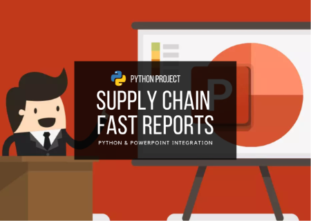

# Supply Chain Fast Reports

### :speech_balloon: Intro

Due to the work routine becoming more and more dense and the need for quick reports being more constant, a way to optimize this procedure of creating and displaying indicators becomes necessary. When we talk about the supply chain, everything is very dynamic and new data is constant. In this way, a way to build reports from the integration between Python and PowerPoint was developed.

### :rocket: Objectives

> - Optimize the creation of quick reports, reducing the time in their construction.
> - From the Pandas and Matplot libraries generate graphs and indicators to insert in PowerPoint presentations.
> - By means of transport data obtain general supply indicators.

## :chart_with_upwards_trend: Results

> - Reports are created in less than 10 seconds, including graphs and indicators.
> - Intro page built.
> - Code adapted for any type of graphics from Matplotlib and Pyplot libraries.

<!--## :bar_chart: Images-->
<table>
  <tr>
    <td align="center">
      <a href="image-1.png">
         
        
          <b>Report complete!</b>
        
      </a>
    </td>
    <td align="center">
      <a href="image-2.png">
         
        
          <b>Most used transport type</b>
        
      </a>
    </td>
</table>
